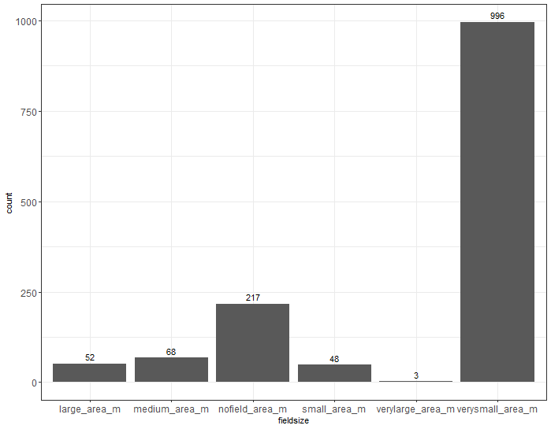

```{r setup, include=FALSE}
knitr::opts_chunk$set(echo = TRUE)
getwd()
load("...\\data\\202509011_data.RData") #data_20250911
```

## Data set profile 
 - **Date**: This dataset was created on the 11.09.2025
 - **Description**: This dataset was built upon the processed dataset from December 2024, which contains the values for natural habitat, cropland, simpsons diversity etc. In addition it contains soil values from the SoilGrids and field size values from 
Lesiv et al 2018, both of which were calculated for 1000m, 2500m, 5000m radii in GEE. All variables that were calculated for buffers have a .{bufferradius_in_m} suffix at the end of the name.
- **Note**: Some observations might have aquired the "nofield" status, although they do have a field within the buffer. It happens due to the way the "fieldsize" is getting assigned and that is by extracting the value of the raster directly beneath the observation point. So, although there might be a fuield present in the buffer, the "fieldsize" will get assigned to the precise point extraction value. 

**What do fieldsizes mean**


 - nofield_area_m ~ "nofield",
 - verylarge_area_m ~ "greater than 100 ha",
 - large_area_m ~ "between 16 ha and 100 ha",
 - medium_area_m~ "between 2.56 ha and 16 ha",
 - small_area_m ~ "between 0.64 ha and 2.56 ha",
 - verysmall_area_m ~ "less than 0.64 ha"

```{r fieldsize distribution}
library(ggplot2)
ggplot(data.frame(data_20250911), aes(x=fieldsize)) +
  geom_bar() +
  geom_text(aes(label=after_stat(count)), vjust=-0.5, stat = "count")+
  theme_bw()
  
```



## Data Overview 

```{r}
dplyr::glimpse(data_20250911)
```

|Column                                     |Type      |Example                                                                                                                                                                                                                                                                                                                                                                                                                             |
|:------------------------------------------|:---------|:-----------------------------------------------------------------------------------------------------------------------------------------------------------------------------------------------------------------------------------------------------------------------------------------------------------------------------------------------------------------------------------------------------------------------------------|
|landcover_map_year                         |integer   |1985, 1990, 1995                                                                                                                                                                                                                                                                                                                                                                                                                    |
|treatment                                  |character |Cover crops, Liming, Super absorbent polymer                                                                                                                                                                                                                                                                                                                                                                                        |
|Lat_long                                   |character |40.8-82, -36.3666666666667146.683333333333, -36146                                                                                                                                                                                                                                                                                                                                                                                  |
|crop_type                                  |character |Maize, Grassland, Upland Arable Land                                                                                                                                                                                                                                                                                                                                                                                                |
|mean_yield_control_kgha                    |numeric   |10100, 5322.22222222222, 1581                                                                                                                                                                                                                                                                                                                                                                                                       |
|mean_yield_treatment_kgha                  |numeric   |9676.66666666667, 6134.44444444444, 2236.25                                                                                                                                                                                                                                                                                                                                                                                         |
|yield_SD_control                           |numeric   |NA, 7983.17605968953, 2944.01086954515                                                                                                                                                                                                                                                                                                                                                                                              |
|yield_SD_treatment                         |numeric   |NA, 5842.40532657569, 2637.00587788499                                                                                                                                                                                                                                                                                                                                                                                              |
|replicates_control_summed                  |integer   |9, 432, 160                                                                                                                                                                                                                                                                                                                                                                                                                         |
|replicates_treatment_summed                |integer   |9, 432, 160                                                                                                                                                                                                                                                                                                                                                                                                                         |
|n_aggregated                               |integer   |3, 27, 40                                                                                                                                                                                                                                                                                                                                                                                                                           |
|ma_id                                      |character |D473, D973, D652                                                                                                                                                                                                                                                                                                                                                                                                                    |
|measurement_id                             |numeric   |1451, 4970, 4014                                                                                                                                                                                                                                                                                                                                                                                                                    |
|study_id                                   |numeric   |1, 61, 25                                                                                                                                                                                                                                                                                                                                                                                                                           |
|control_id                                 |integer   |1, 14, 3                                                                                                                                                                                                                                                                                                                                                                                                                            |
|author_year                                |character |, Ridley and Coventry 1992, Coventry et al. 1987                                                                                                                                                                                                                                                                                                                                                                                    |
|title                                      |character |, Invertebrates and nutrients in a Mediterranean vineyard mulched with subterranean clover (Trifolium subterraneum L.), Granny Smith conversions to organic show early success                                                                                                                                                                                                                                                      |
|study_pubyear                              |integer   |1991, 1992, 1987                                                                                                                                                                                                                                                                                                                                                                                                                    |
|harvest_year                               |integer   |NA, 1988, 1981                                                                                                                                                                                                                                                                                                                                                                                                                      |
|region                                     |character |, Beechworth, Lilliput                                                                                                                                                                                                                                                                                                                                                                                                              |
|country                                    |character |USA,  Australia,  Nigeria                                                                                                                                                                                                                                                                                                                                                                                                           |
|yield_unit                                 |character |Mg/ha, t/ha, kg/ha                                                                                                                                                                                                                                                                                                                                                                                                                  |
|soil_type                                  |character |, Yellow podsoilc soil, Dark Brown Chernozemic                                                                                                                                                                                                                                                                                                                                                                                      |
|temperature                                |character |9.5, , 17.50                                                                                                                                                                                                                                                                                                                                                                                                                        |
|precipitation                              |character |965, 800 , 590                                                                                                                                                                                                                                                                                                                                                                                                                      |
|climate_zone                               |character |Cold, , Tropical                                                                                                                                                                                                                                                                                                                                                                                                                    |
|LRR                                        |numeric   |NA, -0.037, -0.086                                                                                                                                                                                                                                                                                                                                                                                                                  |
|LRR_vi                                     |numeric   |NA, 0.009, 0.025                                                                                                                                                                                                                                                                                                                                                                                                                    |
|reference                                  |character |, 72.   Wei, Q.F., Zhang, Y.L., Zang, Y. S. The Effects of Comprehensive Water Conservation Technique on Grain crop Yield in soil-Plant System. Agricultural Research in the Arid Areas (01):24-27 (1993)(in Chinese with English abstract)., 28.   Sun, Y.X., Li, J, C., Zhao, F.P. Effect of water retaining agent on wheat growth and yield. Beijing Agricultural Science 08(10) (1994). (in Chinese with English abstract). |
|longitude_decimal                          |numeric   |-82, 146.683333333333, 146                                                                                                                                                                                                                                                                                                                                                                                                          |
|latitude_decimal                           |numeric   |40.8, -36.3666666666667, -36                                                                                                                                                                                                                                                                                                                                                                                                        |
|country_new                                |character |United States of America, Australia, Nigeria                                                                                                                                                                                                                                                                                                                                                                                        |
|crop_type_grouped_small                    |character |Maize, Grassland, Wheat                                                                                                                                                                                                                                                                                                                                                                                                             |
|crop_type_grouped_big                      |character |Grains, Grassland, Fruits                                                                                                                                                                                                                                                                                                                                                                                                           |
|publication_to_harvest_year_difference     |integer   |NA, 4, 6                                                                                                                                                                                                                                                                                                                                                                                                                            |
|harvest_year_by_median                     |integer   |1984, 1985, 1980                                                                                                                                                                                                                                                                                                                                                                                                                    |
|nat.hab.1000                               |numeric   |0.431910690864906, 0.189905367974462, 0.485802609979275                                                                                                                                                                                                                                                                                                                                                                             |
|nat.hab.2500                               |numeric   |0.363642770963178, 0.383680102774014, 0.407507697784507                                                                                                                                                                                                                                                                                                                                                                             |
|nat.hab.5000                               |numeric   |0.413023369328746, 0.483600183659581, 0.341850155266187                                                                                                                                                                                                                                                                                                                                                                             |
|nat.hab.edgelength.1000                    |numeric   |1525475.19529241, 779487.933968834, 1052165.12771014                                                                                                                                                                                                                                                                                                                                                                                |
|nat.hab.edgelength.2500                    |numeric   |6690468.829617, 4118659.81870904, 5975834.420317                                                                                                                                                                                                                                                                                                                                                                                    |
|nat.hab.edgelength.5000                    |numeric   |26643136.0336794, 13677992.107329, 21131500.5557074                                                                                                                                                                                                                                                                                                                                                                                 |
|nat.hab.peri.area.ratio.1000               |numeric   |1.1364354649632, 1.32204243001492, 0.697642413887434                                                                                                                                                                                                                                                                                                                                                                                |
|nat.hab.peri.area.ratio.2500               |numeric   |0.947180186929131, 0.553193523767306, 0.755768554229528                                                                                                                                                                                                                                                                                                                                                                             |
|nat.hab.peri.area.ratio.5000               |numeric   |0.830234551618757, 0.364389167395921, 0.796452147559551                                                                                                                                                                                                                                                                                                                                                                             |
|nat.hab.wo.grass.1000                      |numeric   |0.277920284185424, 0.189905367974462, 0.485802609979275                                                                                                                                                                                                                                                                                                                                                                             |
|nat.hab.wo.grass.2500                      |numeric   |0.239633758199318, 0.383493702598135, 0.407507697784507                                                                                                                                                                                                                                                                                                                                                                             |
|nat.hab.wo.grass.5000                      |numeric   |0.271383500270612, 0.483516300062576, 0.341850155266187                                                                                                                                                                                                                                                                                                                                                                             |
|nat.hab.wo.grass.edgelength.1000           |numeric   |480264.053072568, 779487.933968834, 1052165.12771014                                                                                                                                                                                                                                                                                                                                                                                |
|nat.hab.wo.grass.edgelength.2500           |numeric   |1568099.6569046, 4111128.98679223, 5975834.420317                                                                                                                                                                                                                                                                                                                                                                                   |
|nat.hab.wo.grass.edgelength.5000           |numeric   |6701680.86958486, 13663310.0044211, 21131500.5557074                                                                                                                                                                                                                                                                                                                                                                                |
|nat.hab.wo.grass.peri.area.ratio.1000      |numeric   |0.556023847561921, 1.32204243001492, 0.697642413887434                                                                                                                                                                                                                                                                                                                                                                              |
|nat.hab.wo.grass.peri.area.ratio.2500      |numeric   |0.336881120226472, 0.552450420368709, 0.755768554229528                                                                                                                                                                                                                                                                                                                                                                             |
|nat.hab.wo.grass.peri.area.ratio.5000      |numeric   |0.317826708194371, 0.364061176948181, 0.796452147559551                                                                                                                                                                                                                                                                                                                                                                             |
|cropland.1000                              |numeric   |0.450914615583525, 0.483276327453159, 0.33819846183834                                                                                                                                                                                                                                                                                                                                                                              |
|cropland.2500                              |numeric   |0.595113882351523, 0.494601480863262, 0.367490479289045                                                                                                                                                                                                                                                                                                                                                                             |
|cropland.5000                              |numeric   |0.510268247042132, 0.484194526280169, 0.57355323128463                                                                                                                                                                                                                                                                                                                                                                              |
|crop.peri.area.ratio.1000                  |numeric   |0.839543969246642, 0.954182441995967, 0.779105453499705                                                                                                                                                                                                                                                                                                                                                                             |
|crop.peri.area.ratio.2500                  |numeric   |0.397706663074919, 0.463258042470562, 0.757950001338405                                                                                                                                                                                                                                                                                                                                                                             |
|crop.peri.area.ratio.5000                  |numeric   |0.488195836343079, 0.243918840511184, 0.294166928645556                                                                                                                                                                                                                                                                                                                                                                             |
|crop.edgelength.1000                       |numeric   |1176533.17211159, 1431705.5400472, 818010.835090891                                                                                                                                                                                                                                                                                                                                                                                 |
|crop.edgelength.2500                       |numeric   |4597396.24432623, 4446189.18463535, 5404562.83871322                                                                                                                                                                                                                                                                                                                                                                                |
|crop.edgelength.5000                       |numeric   |19355416.8374997, 9167177.83525048, 13094907.8130764                                                                                                                                                                                                                                                                                                                                                                                |
|inert.1000                                 |numeric   |0.117174693551569, 0.326818304572379, 0.175998928182384                                                                                                                                                                                                                                                                                                                                                                             |
|inert.2500                                 |numeric   |0.0412433466852992, 0.121718416362725, 0.225001822926449                                                                                                                                                                                                                                                                                                                                                                            |
|inert.5000                                 |numeric   |0.0767083836291216, 0.0322052900602502, 0.0845966134491825                                                                                                                                                                                                                                                                                                                                                                          |
|inert.edgelength.1000                      |numeric   |613370.704562179, 952516.425966499, 532568.868510911                                                                                                                                                                                                                                                                                                                                                                                |
|inert.edgelength.2500                      |numeric   |2250026.89015346, 3217620.17407507, 3323915.5677623                                                                                                                                                                                                                                                                                                                                                                                 |
|inert.edgelength.5000                      |numeric   |8169164.53275403, 4181813.96567813, 7838467.96400736                                                                                                                                                                                                                                                                                                                                                                                |
|inert.peri.area.ratio.1000                 |numeric   |1.68431294082468, 0.938727063565902, 0.974708086483031                                                                                                                                                                                                                                                                                                                                                                              |
|inert.peri.area.ratio.2500                 |numeric   |2.80856721073666, 1.36228798123477, 0.76135994740732                                                                                                                                                                                                                                                                                                                                                                                |
|inert.peri.area.ratio.5000                 |numeric   |1.37064472163135, 1.67288874658689, 1.19383234561718                                                                                                                                                                                                                                                                                                                                                                                |
|shannon.1000                               |numeric   |1.17326905857144, 1.58085478248292, 1.64434130352459                                                                                                                                                                                                                                                                                                                                                                                |
|shannon.2500                               |numeric   |0.964624196152627, 1.55165577173298, 1.850030843844                                                                                                                                                                                                                                                                                                                                                                                 |
|shannon.5000                               |numeric   |1.05395048640593, 1.41933310260323, 1.66172101821645                                                                                                                                                                                                                                                                                                                                                                                |
|simpsonsevenness.1000                      |numeric   |2.71578103518132, 4.07904995555664, 3.77596991672152                                                                                                                                                                                                                                                                                                                                                                                |
|simpsonsevenness.2500                      |numeric   |2.17661965248666, 3.92908386646866, 5.22546295009561                                                                                                                                                                                                                                                                                                                                                                                |
|simpsonsevenness.5000                      |numeric   |2.45393039887699, 3.33849825998667, 3.84558906311955                                                                                                                                                                                                                                                                                                                                                                                |
|bdod_bdod_0.5cm_mean_mean.1000             |numeric   |133.992362023653, 115.429616686688, 113.844194203434                                                                                                                                                                                                                                                                                                                                                                                |
|bdod_bdod_0.5cm_mean_mean.2500             |numeric   |135.217580548964, 113.887976060182, 112.846446321393                                                                                                                                                                                                                                                                                                                                                                                |
|bdod_bdod_0.5cm_mean_mean.5000             |numeric   |134.823301230158, 112.865240703782, 113.083637466912                                                                                                                                                                                                                                                                                                                                                                                |
|bdod_bdod_100.200cm_mean_mean.1000         |numeric   |176.70885348226, 151.437697936005, 141.873730847332                                                                                                                                                                                                                                                                                                                                                                                 |
|bdod_bdod_100.200cm_mean_mean.2500         |numeric   |175.888608301714, 150.351920865602, 140.397816463431                                                                                                                                                                                                                                                                                                                                                                                |
|bdod_bdod_100.200cm_mean_mean.5000         |numeric   |176.102485353274, 149.286455394596, 142.010240873794                                                                                                                                                                                                                                                                                                                                                                                |
|bdod_bdod_15.30cm_mean_mean.1000           |numeric   |155.992690538765, 131.735502893961, 128.813734539413                                                                                                                                                                                                                                                                                                                                                                                |
|bdod_bdod_15.30cm_mean_mean.2500           |numeric   |156.207479410682, 129.54772031421, 129.078732245186                                                                                                                                                                                                                                                                                                                                                                                 |
|bdod_bdod_15.30cm_mean_mean.5000           |numeric   |155.904311395236, 127.624143567852, 131.787298502344                                                                                                                                                                                                                                                                                                                                                                                |
|bdod_bdod_30.60cm_mean_mean.1000           |numeric   |165.0948587, 144.831058206836, 136.94461879269                                                                                                                                                                                                                                                                                                                                                                                      |
|bdod_bdod_30.60cm_mean_mean.2500           |numeric   |166.016166897199, 142.45795985093, 136.070720512751                                                                                                                                                                                                                                                                                                                                                                                 |
|bdod_bdod_30.60cm_mean_mean.5000           |numeric   |166.034738194989, 141.235222615935, 138.581241040884                                                                                                                                                                                                                                                                                                                                                                                |
|bdod_bdod_5.15cm_mean_mean.1000            |numeric   |148.980124835742, 121.465873102545, 121.191988185342                                                                                                                                                                                                                                                                                                                                                                                |
|bdod_bdod_5.15cm_mean_mean.2500            |numeric   |149.240574597414, 120.273077402641, 120.39279215665                                                                                                                                                                                                                                                                                                                                                                                 |
|bdod_bdod_5.15cm_mean_mean.5000            |numeric   |149.172906477942, 119.438348170097, 122.712129873099                                                                                                                                                                                                                                                                                                                                                                                |
|bdod_bdod_60.100cm_mean_mean.1000          |numeric   |173.920581471748, 149.753958720105, 139.731954956618                                                                                                                                                                                                                                                                                                                                                                                |
|bdod_bdod_60.100cm_mean_mean.2500          |numeric   |173.538367828636, 148.406020975049, 138.707721137394                                                                                                                                                                                                                                                                                                                                                                                |
|bdod_bdod_60.100cm_mean_mean.5000          |numeric   |173.144694630369, 147.309389236925, 140.83237769433                                                                                                                                                                                                                                                                                                                                                                                 |
|cec_cec_0.5cm_mean_mean.1000               |numeric   |247.826394021516, 180.022311710927, 229.150382630361                                                                                                                                                                                                                                                                                                                                                                                |
|cec_cec_0.5cm_mean_mean.2500               |numeric   |247.176585539172, 184.265126009671, 213.710574588616                                                                                                                                                                                                                                                                                                                                                                                |
|cec_cec_0.5cm_mean_mean.5000               |numeric   |242.693486052047, 185.3517510656, 194.137619826162                                                                                                                                                                                                                                                                                                                                                                                  |
|cec_cec_100.200cm_mean_mean.1000           |numeric   |147.048123511538, 134.304201131911, 180.967431927389                                                                                                                                                                                                                                                                                                                                                                                |
|cec_cec_100.200cm_mean_mean.2500           |numeric   |142.126449762708, 135.578466824612, 175.021985432965                                                                                                                                                                                                                                                                                                                                                                                |
|cec_cec_100.200cm_mean_mean.5000           |numeric   |140.544632111049, 138.296520438234, 176.8519042881                                                                                                                                                                                                                                                                                                                                                                                  |
|cec_cec_15.30cm_mean_mean.1000             |numeric   |199.279789767595, 147.998040922943, 180.835913863677                                                                                                                                                                                                                                                                                                                                                                                |
|cec_cec_15.30cm_mean_mean.2500             |numeric   |189.573991828033, 146.906853983956, 169.418316698139                                                                                                                                                                                                                                                                                                                                                                                |
|cec_cec_15.30cm_mean_mean.5000             |numeric   |183.670504693894, 147.599747222348, 163.646524329039                                                                                                                                                                                                                                                                                                                                                                                |
|cec_cec_30.60cm_mean_mean.1000             |numeric   |211.360105116203, 144.42827601219, 174.967609894999                                                                                                                                                                                                                                                                                                                                                                                 |
|cec_cec_30.60cm_mean_mean.2500             |numeric   |196.975369895693, 141.640688862103, 169.308578365255                                                                                                                                                                                                                                                                                                                                                                                |
|cec_cec_30.60cm_mean_mean.5000             |numeric   |187.426027708684, 141.030707326038, 168.996567942036                                                                                                                                                                                                                                                                                                                                                                                |
|cec_cec_5.15cm_mean_mean.1000              |numeric   |202.019380799869, 158.820744449282, 187.870617547606                                                                                                                                                                                                                                                                                                                                                                                |
|cec_cec_5.15cm_mean_mean.2500              |numeric   |188.188856178464, 160.953184532469, 179.604747774481                                                                                                                                                                                                                                                                                                                                                                                |
|cec_cec_5.15cm_mean_mean.5000              |numeric   |180.049372810185, 161.762366437318, 173.970584238833                                                                                                                                                                                                                                                                                                                                                                                |
|cec_cec_60.100cm_mean_mean.1000            |numeric   |180.918781309025, 135.275468001741, 182.841074924364                                                                                                                                                                                                                                                                                                                                                                                |
|cec_cec_60.100cm_mean_mean.2500            |numeric   |172.522840900439, 134.987489089322, 175.648691664419                                                                                                                                                                                                                                                                                                                                                                                |
|cec_cec_60.100cm_mean_mean.5000            |numeric   |168.146269624756, 137.430821462886, 174.575472401082                                                                                                                                                                                                                                                                                                                                                                                |
|clay_clay_0.5cm_mean_mean.1000             |numeric   |268.913114888725, 157.724423160644, 234.113009432283                                                                                                                                                                                                                                                                                                                                                                                |
|clay_clay_0.5cm_mean_mean.2500             |numeric   |271.66724614877, 155.953904983582, 242.847639600755                                                                                                                                                                                                                                                                                                                                                                                 |
|clay_clay_0.5cm_mean_mean.5000             |numeric   |264.434599748589, 162.412414477969, 251.408134371863                                                                                                                                                                                                                                                                                                                                                                                |
|clay_clay_100.200cm_mean_mean.1000         |numeric   |327.802085899647, 308.947322594689, 342.046449546183                                                                                                                                                                                                                                                                                                                                                                                |
|clay_clay_100.200cm_mean_mean.2500         |numeric   |328.113163972286, 304.033223880183, 372.004424062584                                                                                                                                                                                                                                                                                                                                                                                |
|clay_clay_100.200cm_mean_mean.5000         |numeric   |322.469486346252, 308.493522572657, 412.626431667857                                                                                                                                                                                                                                                                                                                                                                                |
|clay_clay_15.30cm_mean_mean.1000           |numeric   |318.796583723413, 230.395515890292, 279.601530521445                                                                                                                                                                                                                                                                                                                                                                                |
|clay_clay_15.30cm_mean_mean.2500           |numeric   |328.888726746694, 227.365975310695, 309.298732128406                                                                                                                                                                                                                                                                                                                                                                                |
|clay_clay_15.30cm_mean_mean.5000           |numeric   |324.119650833133, 232.600456547392, 332.178857120315                                                                                                                                                                                                                                                                                                                                                                                |
|clay_clay_30.60cm_mean_mean.1000           |numeric   |342.079083518108, 320.600892468437, 352.307528029899                                                                                                                                                                                                                                                                                                                                                                                |
|clay_clay_30.60cm_mean_mean.2500           |numeric   |349.130472299064, 312.636172187816, 389.657998381441                                                                                                                                                                                                                                                                                                                                                                                |
|clay_clay_30.60cm_mean_mean.5000           |numeric   |346.026645537457, 315.854646401465, 434.741105359358                                                                                                                                                                                                                                                                                                                                                                                |
|clay_clay_5.15cm_mean_mean.1000            |numeric   |262.043688921738, 195.987265999129, 241.460936109628                                                                                                                                                                                                                                                                                                                                                                                |
|clay_clay_5.15cm_mean_mean.2500            |numeric   |265.466385808187, 191.825262895382, 244.750849743728                                                                                                                                                                                                                                                                                                                                                                                |
|clay_clay_5.15cm_mean_mean.5000            |numeric   |259.402033352055, 195.23398698711, 257.734337674178                                                                                                                                                                                                                                                                                                                                                                                 |
|clay_clay_60.100cm_mean_mean.1000          |numeric   |346.135337110947, 332.774379625599, 363.294180459156                                                                                                                                                                                                                                                                                                                                                                                |
|clay_clay_60.100cm_mean_mean.2500          |numeric   |347.302058218918, 326.927566953462, 399.752522255193                                                                                                                                                                                                                                                                                                                                                                                |
|clay_clay_60.100cm_mean_mean.5000          |numeric   |340.894190136136, 325.865702199552, 444.17819525473                                                                                                                                                                                                                                                                                                                                                                                 |
|nitrogen_nitrogen_0.5cm_mean_mean.1000     |numeric   |7294.08113656894, 3352.84719198955, 3143.050899                                                                                                                                                                                                                                                                                                                                                                                     |
|nitrogen_nitrogen_0.5cm_mean_mean.2500     |numeric   |7219.40480420273, 3532.77248985134, 2854.8615592123                                                                                                                                                                                                                                                                                                                                                                                 |
|nitrogen_nitrogen_0.5cm_mean_mean.5000     |numeric   |6946.55633007034, 3563.29050407217, 2572.8493795558                                                                                                                                                                                                                                                                                                                                                                                 |
|nitrogen_nitrogen_100.200cm_mean_mean.1000 |numeric   |1010.01371437957, 422.906943839791, 264.078305748354                                                                                                                                                                                                                                                                                                                                                                                |
|nitrogen_nitrogen_100.200cm_mean_mean.2500 |numeric   |1085.85234626805, 436.163403854414, 262.975991367683                                                                                                                                                                                                                                                                                                                                                                                |
|nitrogen_nitrogen_100.200cm_mean_mean.5000 |numeric   |1148.53108868919, 474.268021692449, 342.349259017371                                                                                                                                                                                                                                                                                                                                                                                |
|nitrogen_nitrogen_15.30cm_mean_mean.1000   |numeric   |1589.70674221894, 1217.60655202438, 965.237942694429                                                                                                                                                                                                                                                                                                                                                                                |
|nitrogen_nitrogen_15.30cm_mean_mean.2500   |numeric   |1770.44806233028, 1164.23772115771, 989.324035608308                                                                                                                                                                                                                                                                                                                                                                                |
|nitrogen_nitrogen_15.30cm_mean_mean.5000   |numeric   |1736.83952833721, 1222.65430721513, 1018.47550878177                                                                                                                                                                                                                                                                                                                                                                                |
|nitrogen_nitrogen_30.60cm_mean_mean.1000   |numeric   |1596.50915660672, 664.57705703091, 655.234205374622                                                                                                                                                                                                                                                                                                                                                                                 |
|nitrogen_nitrogen_30.60cm_mean_mean.2500   |numeric   |1682.50720757303, 685.959987253557, 621.790315619099                                                                                                                                                                                                                                                                                                                                                                                |
|nitrogen_nitrogen_30.60cm_mean_mean.5000   |numeric   |1771.51388443125, 743.155725865215, 614.008560420438                                                                                                                                                                                                                                                                                                                                                                                |
|nitrogen_nitrogen_5.15cm_mean_mean.1000    |numeric   |2828.20013139525, 2336.90084893339, 1741.07830574835                                                                                                                                                                                                                                                                                                                                                                                |
|nitrogen_nitrogen_5.15cm_mean_mean.2500    |numeric   |2964.40136537827, 2421.1266885573, 1527.81823577016                                                                                                                                                                                                                                                                                                                                                                                 |
|nitrogen_nitrogen_5.15cm_mean_mean.5000    |numeric   |2838.70811602343, 2441.47745313619, 1356.40916442757                                                                                                                                                                                                                                                                                                                                                                                |
|nitrogen_nitrogen_60.100cm_mean_mean.1000  |numeric   |1019.07497741644, 517.490313452329, 392.219078127781                                                                                                                                                                                                                                                                                                                                                                                |
|nitrogen_nitrogen_60.100cm_mean_mean.2500  |numeric   |1102.8456335812, 537.151170040318, 390.983301861343                                                                                                                                                                                                                                                                                                                                                                                 |
|nitrogen_nitrogen_60.100cm_mean_mean.5000  |numeric   |1180.61745098826, 574.085544600424, 431.31849322574                                                                                                                                                                                                                                                                                                                                                                                 |
|ocd_ocd_0.5cm_mean_mean.1000               |numeric   |415.3582984, 479.1424684, 383.495995728777                                                                                                                                                                                                                                                                                                                                                                                          |
|ocd_ocd_0.5cm_mean_mean.2500               |numeric   |416.166332512753, 488.101569752137, 362.664634475317                                                                                                                                                                                                                                                                                                                                                                                |
|ocd_ocd_0.5cm_mean_mean.5000               |numeric   |420.11432506887, 482.86031777762, 347.178708090978                                                                                                                                                                                                                                                                                                                                                                                  |
|ocd_ocd_100.200cm_mean_mean.1000           |numeric   |41.6291368974296, 65.2018937744885, 218.25484961737                                                                                                                                                                                                                                                                                                                                                                                 |
|ocd_ocd_100.200cm_mean_mean.2500           |numeric   |47.029528208512, 65.4747911384513, 187.393121122201                                                                                                                                                                                                                                                                                                                                                                                 |
|ocd_ocd_100.200cm_mean_mean.5000           |numeric   |44.4498883361416, 68.2917776330468, 183.42961651245                                                                                                                                                                                                                                                                                                                                                                                 |
|ocd_ocd_15.30cm_mean_mean.1000             |numeric   |179.278722181161, 237.36700043535, 246.869193806727                                                                                                                                                                                                                                                                                                                                                                                 |
|ocd_ocd_15.30cm_mean_mean.2500             |numeric   |182.075857168236, 239.705612591269, 219.277043431346                                                                                                                                                                                                                                                                                                                                                                                |
|ocd_ocd_15.30cm_mean_mean.5000             |numeric   |178.892913022547, 234.972778039296, 208.281336705487                                                                                                                                                                                                                                                                                                                                                                                |
|ocd_ocd_30.60cm_mean_mean.1000             |numeric   |91.1552927650488, 120.335655202438, 211.25431571454                                                                                                                                                                                                                                                                                                                                                                                 |
|ocd_ocd_30.60cm_mean_mean.2500             |numeric   |91.1823845900058, 123.614752622026, 194.331912597788                                                                                                                                                                                                                                                                                                                                                                                |
|ocd_ocd_30.60cm_mean_mean.5000             |numeric   |89.4912006205034, 129.596306995879, 184.759194890924                                                                                                                                                                                                                                                                                                                                                                                |
|ocd_ocd_5.15cm_mean_mean.1000              |numeric   |249.064547918206, 341.175881584676, 276.789464317494                                                                                                                                                                                                                                                                                                                                                                                |
|ocd_ocd_5.15cm_mean_mean.2500              |numeric   |246.855112554881, 344.39224406667, 242.275748583761                                                                                                                                                                                                                                                                                                                                                                                 |
|ocd_ocd_5.15cm_mean_mean.5000              |numeric   |246.436324854904, 341.789962405773, 226.47008674384                                                                                                                                                                                                                                                                                                                                                                                 |
|ocd_ocd_60.100cm_mean_mean.1000            |numeric   |57.7404943746407, 89.7570744449282, 239.269620928991                                                                                                                                                                                                                                                                                                                                                                                |
|ocd_ocd_60.100cm_mean_mean.2500            |numeric   |61.4379108189732, 90.0845283123432, 208.421796601025                                                                                                                                                                                                                                                                                                                                                                                |
|ocd_ocd_60.100cm_mean_mean.5000            |numeric   |59.2196969696969, 90.6518955099724, 198.082597318348                                                                                                                                                                                                                                                                                                                                                                                |
|ocs_ocs_0.30cm_mean_mean.1000              |numeric   |55.9086802989242, 68.482477144101, 41.9590674497242                                                                                                                                                                                                                                                                                                                                                                                 |
|ocs_ocs_0.30cm_mean_mean.2500              |numeric   |55.3736009948481, 69.247558086371, 41.9301591583491                                                                                                                                                                                                                                                                                                                                                                                 |
|ocs_ocs_0.30cm_mean_mean.5000              |numeric   |54.3435335259034, 69.0094017810507, 38.2308946581749                                                                                                                                                                                                                                                                                                                                                                                |
|phh2o_phh2o_0.5cm_mean_mean.1000           |numeric   |60.5253346472858, 58.5314540705268, 65.7837693539776                                                                                                                                                                                                                                                                                                                                                                                |
|phh2o_phh2o_0.5cm_mean_mean.2500           |numeric   |60.4233560896378, 57.7950039486263, 65.3886970596169                                                                                                                                                                                                                                                                                                                                                                                |
|phh2o_phh2o_0.5cm_mean_mean.5000           |numeric   |59.9997559442617, 57.0380133740013, 64.3964969339405                                                                                                                                                                                                                                                                                                                                                                                |
|phh2o_phh2o_100.200cm_mean_mean.1000       |numeric   |68.2708384659604, 60.3116020896822, 76.88592276                                                                                                                                                                                                                                                                                                                                                                                     |
|phh2o_phh2o_100.200cm_mean_mean.2500       |numeric   |68.7971347359338, 59.5790210177757, 75.6019152953871                                                                                                                                                                                                                                                                                                                                                                                |
|phh2o_phh2o_100.200cm_mean_mean.5000       |numeric   |68.3953702960765, 59.2440916447958, 76.2195377460628                                                                                                                                                                                                                                                                                                                                                                                |
|phh2o_phh2o_15.30cm_mean_mean.1000         |numeric   |59.6564835345323, 58.8584022638224, 67.7533368926855                                                                                                                                                                                                                                                                                                                                                                                |
|phh2o_phh2o_15.30cm_mean_mean.2500         |numeric   |59.4829581503946, 58.1512254596339, 67.03984353925                                                                                                                                                                                                                                                                                                                                                                                  |
|phh2o_phh2o_15.30cm_mean_mean.5000         |numeric   |59.1682781031854, 57.3740109751929, 66.1791595622044                                                                                                                                                                                                                                                                                                                                                                                |
|phh2o_phh2o_30.60cm_mean_mean.1000         |numeric   |60.1585776463825, 59.5905528950806, 72.8382274426055                                                                                                                                                                                                                                                                                                                                                                                |
|phh2o_phh2o_30.60cm_mean_mean.2500         |numeric   |59.8823693627388, 58.7441705806559, 71.6737253844078                                                                                                                                                                                                                                                                                                                                                                                |
|phh2o_phh2o_30.60cm_mean_mean.5000         |numeric   |59.5606328064404, 57.9877061072886, 71.522071683111                                                                                                                                                                                                                                                                                                                                                                                 |
|phh2o_phh2o_5.15cm_mean_mean.1000          |numeric   |60.3035230352303, 58.75054419, 66.2710446698701                                                                                                                                                                                                                                                                                                                                                                                     |
|phh2o_phh2o_5.15cm_mean_mean.2500          |numeric   |60.3072989366292, 57.9013120523158, 65.8286485028325                                                                                                                                                                                                                                                                                                                                                                                |
|phh2o_phh2o_5.15cm_mean_mean.5000          |numeric   |59.9802950065527, 57.0954267879827, 64.8531272053054                                                                                                                                                                                                                                                                                                                                                                                |
|phh2o_phh2o_60.100cm_mean_mean.1000        |numeric   |64.3153486080315, 59.8179146713104, 76.0978821854422                                                                                                                                                                                                                                                                                                                                                                                |
|phh2o_phh2o_60.100cm_mean_mean.2500        |numeric   |64.7247037027637, 59.06701580836, 74.6145940113299                                                                                                                                                                                                                                                                                                                                                                                  |
|phh2o_phh2o_60.100cm_mean_mean.5000        |numeric   |64.2558305918853, 58.6229066850661, 74.939025085144                                                                                                                                                                                                                                                                                                                                                                                 |
|sand_sand_0.5cm_mean_mean.1000             |numeric   |208.421286031042, 622.414888985634, 522.329240078306                                                                                                                                                                                                                                                                                                                                                                                |
|sand_sand_0.5cm_mean_mean.2500             |numeric   |204.249574905464, 623.553126342187, 512.705017534394                                                                                                                                                                                                                                                                                                                                                                                |
|sand_sand_0.5cm_mean_mean.5000             |numeric   |198.692693706705, 625.878586121733, 526.12207694297                                                                                                                                                                                                                                                                                                                                                                                 |
|sand_sand_100.200cm_mean_mean.1000         |numeric   |245.434097068243, 510.0500653, 410.729845168179                                                                                                                                                                                                                                                                                                                                                                                     |
|sand_sand_100.200cm_mean_mean.2500         |numeric   |234.924155521153, 512.276431550217, 391.47021850553                                                                                                                                                                                                                                                                                                                                                                                 |
|sand_sand_100.200cm_mean_mean.5000         |numeric   |231.491571718955, 511.859963115098, 380.133368106845                                                                                                                                                                                                                                                                                                                                                                                |
|sand_sand_15.30cm_mean_mean.1000           |numeric   |195.069639484274, 569.960600783631, 484.061932728243                                                                                                                                                                                                                                                                                                                                                                                |
|sand_sand_15.30cm_mean_mean.2500           |numeric   |185.307489277466, 571.179336907879, 460.016050714864                                                                                                                                                                                                                                                                                                                                                                                |
|sand_sand_15.30cm_mean_mean.5000           |numeric   |178.25354047982, 573.101878421688, 461.399468754246                                                                                                                                                                                                                                                                                                                                                                                 |
|sand_sand_30.60cm_mean_mean.1000           |numeric   |192.4607046, 494.38680888115, 423.238298629649                                                                                                                                                                                                                                                                                                                                                                                      |
|sand_sand_30.60cm_mean_mean.2500           |numeric   |186.119483288074, 498.98151765798, 396.351982735365                                                                                                                                                                                                                                                                                                                                                                                 |
|sand_sand_30.60cm_mean_mean.5000           |numeric   |180.607247452459, 502.64799744643, 382.286605330867                                                                                                                                                                                                                                                                                                                                                                                 |
|sand_sand_5.15cm_mean_mean.1000            |numeric   |212.059127864006, 595.698955158903, 509.411461114077                                                                                                                                                                                                                                                                                                                                                                                |
|sand_sand_5.15cm_mean_mean.2500            |numeric   |206.782135877979, 598.036396636047, 507.220151065552                                                                                                                                                                                                                                                                                                                                                                                |
|sand_sand_5.15cm_mean_mean.5000            |numeric   |199.44626093236, 601.467751504091, 517.670167395011                                                                                                                                                                                                                                                                                                                                                                                 |
|sand_sand_60.100cm_mean_mean.1000          |numeric   |229.664942103966, 486.641271223335, 411.302366969212                                                                                                                                                                                                                                                                                                                                                                                |
|sand_sand_60.100cm_mean_mean.2500          |numeric   |220.103443900211, 489.794047965418, 386.234583220933                                                                                                                                                                                                                                                                                                                                                                                |
|sand_sand_60.100cm_mean_mean.5000          |numeric   |212.299212335179, 496.185817368146, 368.625791718352                                                                                                                                                                                                                                                                                                                                                                                |
|silt_silt_0.5cm_mean_mean.1000             |numeric   |522.628972653363, 219.963212886374, 243.513792489767                                                                                                                                                                                                                                                                                                                                                                                |
|silt_silt_0.5cm_mean_mean.2500             |numeric   |524.089612466056, 220.517256189645, 244.465443755058                                                                                                                                                                                                                                                                                                                                                                                |
|silt_silt_0.5cm_mean_mean.5000             |numeric   |536.891301586028, 211.719158869465, 222.468061698145                                                                                                                                                                                                                                                                                                                                                                                |
|silt_silt_100.200cm_mean_mean.1000         |numeric   |426.719306890039, 180.991510666086, 247.316426410393                                                                                                                                                                                                                                                                                                                                                                                |
|silt_silt_100.200cm_mean_mean.2500         |numeric   |436.964076339365, 183.628995386342, 236.550040463987                                                                                                                                                                                                                                                                                                                                                                                |
|silt_silt_100.200cm_mean_mean.5000         |numeric   |446.017254406376, 179.628581285426, 207.25250391202                                                                                                                                                                                                                                                                                                                                                                                 |
|silt_silt_15.30cm_mean_mean.1000           |numeric   |486.159316744683, 199.590661732695, 236.391884676989                                                                                                                                                                                                                                                                                                                                                                                |
|silt_silt_15.30cm_mean_mean.2500           |numeric   |485.789457655508, 201.463596436538, 230.704073374697                                                                                                                                                                                                                                                                                                                                                                                |
|silt_silt_15.30cm_mean_mean.5000           |numeric   |497.627524138115, 194.282288798468, 206.435148130778                                                                                                                                                                                                                                                                                                                                                                                |
|silt_silt_30.60cm_mean_mean.1000           |numeric   |465.375297692371, 185.050174140183, 224.347036839295                                                                                                                                                                                                                                                                                                                                                                                |
|silt_silt_30.60cm_mean_mean.2500           |numeric   |464.726264497627, 188.370533549469, 214.003641758835                                                                                                                                                                                                                                                                                                                                                                                |
|silt_silt_30.60cm_mean_mean.5000           |numeric   |473.360684292171, 181.470853189061, 182.972372590875                                                                                                                                                                                                                                                                                                                                                                                |
|silt_silt_5.15cm_mean_mean.1000            |numeric   |526.004927322, 208.328471919896, 249.156255561488                                                                                                                                                                                                                                                                                                                                                                                   |
|silt_silt_5.15cm_mean_mean.2500            |numeric   |527.835900819735, 210.148703880738, 248.060021580793                                                                                                                                                                                                                                                                                                                                                                                |
|silt_silt_5.15cm_mean_mean.5000            |numeric   |541.16291890663, 203.299825248103, 224.588534384136                                                                                                                                                                                                                                                                                                                                                                                 |
|silt_silt_60.100cm_mean_mean.1000          |numeric   |424.245709123758, 180.592729647366, 225.287061754761                                                                                                                                                                                                                                                                                                                                                                                |
|silt_silt_60.100cm_mean_mean.2500          |numeric   |432.648998807197, 183.275378583205, 213.96706231454                                                                                                                                                                                                                                                                                                                                                                                 |
|silt_silt_60.100cm_mean_mean.5000          |numeric   |446.848006766696, 177.950028050581, 187.201969817176                                                                                                                                                                                                                                                                                                                                                                                |
|soc_soc_0.5cm_mean_mean.1000               |numeric   |524.696862680683, 702.224200065524, 370.789366808196                                                                                                                                                                                                                                                                                                                                                                                |
|soc_soc_0.5cm_mean_mean.2500               |numeric   |495.023869649633, 737.404621714856, 379.312457564977                                                                                                                                                                                                                                                                                                                                                                                |
|soc_soc_0.5cm_mean_mean.5000               |numeric   |500.525072190416, 745.304723797609, 340.573163546183                                                                                                                                                                                                                                                                                                                                                                                |
|soc_soc_100.200cm_mean_mean.1000           |numeric   |74.4789750328515, 88.1478650212952, 57.5106147314011                                                                                                                                                                                                                                                                                                                                                                                |
|soc_soc_100.200cm_mean_mean.2500           |numeric   |67.8478738119107, 99.6972749061387, 45.9461448629858                                                                                                                                                                                                                                                                                                                                                                                |
|soc_soc_100.200cm_mean_mean.5000           |numeric   |58.2951644939994, 100.357807275764, 43.8090246326213                                                                                                                                                                                                                                                                                                                                                                                |
|soc_soc_15.30cm_mean_mean.1000             |numeric   |136.704090013141, 201.318117287321, 114.374007753369                                                                                                                                                                                                                                                                                                                                                                                |
|soc_soc_15.30cm_mean_mean.2500             |numeric   |126.958389909014, 225.985300840942, 109.927812932837                                                                                                                                                                                                                                                                                                                                                                                |
|soc_soc_15.30cm_mean_mean.5000             |numeric   |108.403248151425, 241.581490425693, 105.479645768659                                                                                                                                                                                                                                                                                                                                                                                |
|soc_soc_30.60cm_mean_mean.1000             |numeric   |168.330896846255, 117.185431910014, 76.7561380838102                                                                                                                                                                                                                                                                                                                                                                                |
|soc_soc_30.60cm_mean_mean.2500             |numeric   |143.878012258417, 134.05644144581, 71.3203878221667                                                                                                                                                                                                                                                                                                                                                                                 |
|soc_soc_30.60cm_mean_mean.5000             |numeric   |111.943609687703, 142.500233755598, 65.2382882922496                                                                                                                                                                                                                                                                                                                                                                                |
|soc_soc_5.15cm_mean_mean.1000              |numeric   |249.322109067017, 397.515234247024, 211.039689865239                                                                                                                                                                                                                                                                                                                                                                                |
|soc_soc_5.15cm_mean_mean.2500              |numeric   |247.604380543888, 444.201521175933, 212.996605198121                                                                                                                                                                                                                                                                                                                                                                                |
|soc_soc_5.15cm_mean_mean.5000              |numeric   |239.035616163977, 465.905404751848, 191.399644713352                                                                                                                                                                                                                                                                                                                                                                                |
|soc_soc_60.100cm_mean_mean.1000            |numeric   |85.4376642575559, 95.2969313093808, 69.4631714971386                                                                                                                                                                                                                                                                                                                                                                                |
|soc_soc_60.100cm_mean_mean.2500            |numeric   |74.3583366115504, 107.581510369765, 55.6278753971918                                                                                                                                                                                                                                                                                                                                                                                |
|soc_soc_60.100cm_mean_mean.5000            |numeric   |66.1613727028426, 110.481920213572, 54.9533730245974                                                                                                                                                                                                                                                                                                                                                                                |
|fieldsize                                  |factor    |medium_area_m, nofield_area_m, verysmall_area_m                                                                                                                                                                                                                                                                                                                                                                                     |
|nofield_area_m.5000                        |numeric   |4143015.12052696, 17091571.1819853, 30179561.4405331                                                                                                                                                                                                                                                                                                                                                                                |
|nofield_area_m.2500                        |numeric   |142322.307689951, 6321728.86476716, 14648101.8196998                                                                                                                                                                                                                                                                                                                                                                                |
|nofield_area_m.1000                        |numeric   |NA, 912717.778952206, 3105725.01366422                                                                                                                                                                                                                                                                                                                                                                                              |
|small_area_m.5000                          |numeric   |NA, 57369187.3185662, 69383871.206587                                                                                                                                                                                                                                                                                                                                                                                               |
|small_area_m.2500                          |numeric   |NA, 14699331.8933211, 17752457.5410233                                                                                                                                                                                                                                                                                                                                                                                              |
|small_area_m.1000                          |numeric   |NA, 3092794.28327206, 2032625.69800858                                                                                                                                                                                                                                                                                                                                                                                              |
|verysmall_area_m.5000                      |numeric   |NA, 77288779.5901961, 77472127.2486519                                                                                                                                                                                                                                                                                                                                                                                              |
|verysmall_area_m.2500                      |numeric   |NA, 19315638.0863971, 19363207.1034314                                                                                                                                                                                                                                                                                                                                                                                              |
|verysmall_area_m.1000                      |numeric   |NA, 3083840.20606618, 3094032.35251225                                                                                                                                                                                                                                                                                                                                                                                              |
|large_area_m.5000                          |numeric   |NA, 47419980.4525429, 25073118.7550551                                                                                                                                                                                                                                                                                                                                                                                              |
|large_area_m.2500                          |numeric   |NA, 4750644.90091912, 4655359.54044118                                                                                                                                                                                                                                                                                                                                                                                              |
|large_area_m.1000                          |numeric   |NA, 20289.8370098039, 1875274.0286152                                                                                                                                                                                                                                                                                                                                                                                               |
|verylarge_area_m.5000                      |numeric   |NA, 38395848.9711703, 6888078                                                                                                                                                                                                                                                                                                                                                                                                       |
|verylarge_area_m.2500                      |numeric   |NA, 7876784.1703125, 2086798.78688725                                                                                                                                                                                                                                                                                                                                                                                               |
|verylarge_area_m.1000                      |numeric   |NA, 932044.78125, 1066802.19914216                                                                                                                                                                                                                                                                                                                                                                                                  |
|medium_area_m.5000                         |numeric   |73542179.3997855, 60515459.7304841, NA                                                                                                                                                                                                                                                                                                                                                                                              |
|medium_area_m.2500                         |numeric   |19277792.5619792, 13077258.4693627, NA                                                                                                                                                                                                                                                                                                                                                                                              |
|medium_area_m.1000                         |numeric   |3107067.4122549, 2188337.1528799, NA                                                                                                                                                                                                                                                                                                                                                                                                |
