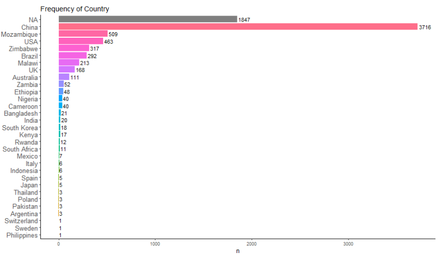
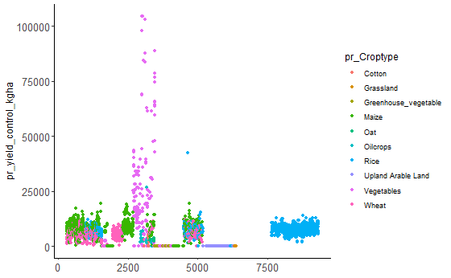
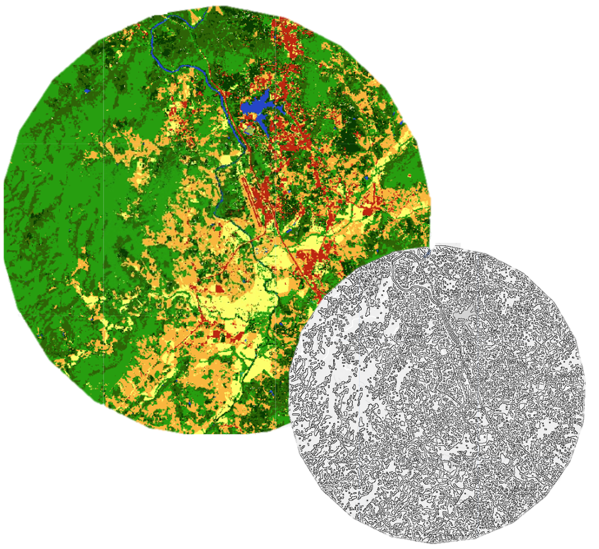
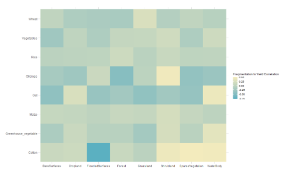

# Report 
## Introduciton 
With global food consumption projected to increase by 1.4% annually over the next decade, driven primarily by population growth, especially in low- and middle-income countries(OECD & Food and Agriculture Organization of the United Nations, 2022), securing sufficient food production is essential. Thus, agriculture must again meet higher goals. Although recent agricultural intensification through pesticide, fertilizer, and machine use has led to increased food production, it has also resulted in a series of environmental costs such as a decline in biodiversity (Köthe et al., 2023; Mamabolo et al., 2024; Zabel et al., 2019), landscape homogenization (Egli et al., 2021), and soil degradation (Mamabolo et al., 2024; Voltr et al., 2021), the latter being crucial for secure food production. These issues can be described as “intensification traps”—production declines triggered by the negative feedback of biodiversity loss at high input levels (Burian et al., 2024). Furthermore, further intensification practices make agricultural fields vulnerable to environmental changes and reduce food supply stability (Egli et al., 2021). Therefore, relying solely on intensified agriculture and expanded cultivation is unsustainable, as climate impacts exacerbate yield gaps and food supply inequities (Seppelt et al., 2024).

Several practices have been undertaken to maintain a more secure and sustainable path to meet rising food production goals. These include the restriction of mineral fertilizers and chemical pesticides, as implemented in organic farming practices, and mulching, crop rotation and reduced tillage, as implemented in conservation agriculture practices. Both practices can mitigate the negative effects of conventional farming while supporting ecosystem services crucial for agricultural productivity (Wittwer et al., 2021). For instance, substituting mineral fertilizers with manure has been demonstrated to reduce environmental pollution and enhance soil quality (Liang et al., 2022; Wang et al., 2023). Crop rotation can sequester atmospheric carbon and improve the resilience of corn production systems to climate change (Joshi et al., 2023). Additionally, practices such as straw return and straw addition have been shown to increase both crop yield and soil organic carbon (D. Liu et al., 2023). Moreover, conservation agriculture has proven to be more resilient to rising global temperatures and heat stress, ensuring stable food production even in a changing climate (Steward et al., 2018).

Recent studies suggest that the effectiveness of such measures is often mediated by the landscapes surrounding the agricultural field (Perrot et al., 2023), due to the positive effects of surrounding landscapes on biodiversity (Dominik et al., 2022; Estrada-Carmona et al., 2022) and agricultural production (Guo et al., 2022) by providing diverse ecosystem services. Contrary to the common observation of a negative correlation between yield and biodiversity (Jones et al., 2023), landscape diversification has been shown to positively affect crop yield with no negative effects for biodiversity (Galpern et al., 2020). DeClerck et al. (2023) even argues that there is no evidence that diversified production systems compromise food security, and many agricultural diversification practices provide multiple complementary benefits to multiple ecosystem services (Jones et al., 2023; Tamburini et al., 2020).

These complementary benefits often arise from spillover effects occurring both from natural to agricultural ecosystems and vice versa (Blitzer et al., 2012). Until recently, spillovers were viewed as obstacles to both agriculture and nature conservation, compromising their stability. For instance, intensive nutrient input and herbicide residues on agricultural lands are considered a threat to biodiversity and nature conservation due to their negative spillover effects on natural habitats (Larsen et al., 2024), with plant communities at the edges between these ecosystems being particularly endangered (Köthe et al., 2023). Older studies have focused on negative spillovers from natural to agricultural lands through the migration of herbivores, pests, and pathogens (Blitzer et al., 2012). However, recent research suggests that agriculture and nature conservation can complement rather than constrain each other through diversification practices and subsequent increases in biodiversity (Stein-Bachinger et al., 2021). 

Introducing semi-natural habitats would increase biodiversity in agricultural mosaics, as landscape diversity provides habitats for insects (Akter et al., 2023; Woltz & Landis, 2014) and birds (Fischer et al., 2011). Hence, increasing landscape complexity has a positive effect on the richness of service-providing organisms, such as pollinators (Bottero et al., 2023) and pest predators (B. Liu et al., 2018). In return, the richness of service-providing organisms positively influences the ecosystem services delivery such as pest control and pollination services (Dainese et al., 2019), resulting in increased crop productivity via ecological intensification (Bommarco et al., 2013) and higher yield stability (Bishop et al., 2022). Natural habitats often host a variety of beneficialinsects, birds, and other predators that can feed on agricultural pests (Tscharntke et al., 2005). These predators can migrate into crop fields and help control pest populations, reducing the need for chemical pesticides through biocontrol (Woltz & Landis, 2014; Yang et al., 2021).

Furthermore, natural habitats can provide pollination services, which benefit the yield of 75% of the world's agricultural crops (Klein et al., 2006). Pollinators that usually feed in natural habitats would fly over to the crop fields when they are flowering (Blitzer et al., 2012). Therefore, there would be a synergistic relationship between the crops, which get pollinated, and the pollinators, which feed on the nectar of the crops. This interaction supports both yield production and pollinator richness (Tscharntke et al., 2005; Yang et al., 2021), the latter being very important in times of recent massive pollinator declines (Janousek et al., 2023; Sritongchuay et al., 2022).
Soil health, carbon, nutrient, and water cycling are essential for supporting food production (De Deyn & Kooistra, 2021). Therefore, securing and rehabilitating soil is a primary concern for agricultural practices. Integrating natural habitats into agricultural mosaics has been found to increase agricultural productivity in adjacent lands by reducing erosion and improving soil biological activity and nutrient availability (Garibaldi et al., 2021). Additionally, forests and tree-based agricultural systems have been shown to contribute to hydrologic regulation (Galindo et al., 2022). However, it remains challenging to disentangle the pure effect of surrounding landscapes on yield, as the interactions and influence of other factors remain complex.

Multifunctionality is an important characteristic of agricultural mosaics (Burian et al., 2023), because they support water regulation, nutrient cycling, biodiversity, recreation and other important ecosystem services. With that in mind,it is crucially important to assess all possible ways of ecological intensification through increased  heterogeneity of land cover types at a regional scale. Several studies have already addressed therelationship between landscape heterogeneity and biodiversity through local field experiments or by calculating estimates on a larger scale using yield estimates or projections. The effects of surrounding landscapes on yield is context-dependent and differs among taxonomic groups and biogeographical regions (Zymaroieva et al., 2021; Martin et al., 2016). Therefore, looking into both class- and landscape-level patterns is crucial to better estimate the influence of surrounding landscapes on the cropfield productivity (Xin et al., 2024). This study will be the first to examine the effects of surrounding landscapes on crop yield globally by collecting data from previous field experiments, putting the data into spatial perspective by utilizing land cover data with 10m resolution on a temporal scale, and analyzing the yield in connection to landscape heterogeneity.

## Methods
Initially, the compiled dataset was evaluated and explored to understand its structure and content. We ensured that each data point included latitude and longitude, yield data, and the primary study source. Data points missing any of these properties were excluded.

All yield measurements were then standardized to the kg/ha metric for appropriate comparison. Some studies (three studies, 1561 observations) recorded both the publication year and the harvest year of the experiment. Using these studies, we calculated the time difference between publication and harvest and recorded the median of this distribution, chosen for its robustness to outliers. The median indicated a 7-year difference between publication and harvest. Consequently, for the entire dataset, the harvest year was calculated by subtracting 7 years from the publication date, including studies that directly indicated the harvest year to ensure consistency.

For land cover data, the GLC_FCS30D dataset developed by Zhang et al. (2024) was used. This dataset, developed using Landsat imagery, includes 35 land cover types at a 30-meter resolution, spanning the period from 1985 to 2022, with updates every five years before 2000 and annually thereafter.

Data points after 2000 were assigned to the corresponding land cover datasets. Points prior to 2000 were assigned to a 5-year range; for example, data points from 1988 to 1992 were assigned to the 1990 land cover dataset. For 1985, the range was from 1975 to 1987, and data points with a harvest year before 1975 were excluded.

The resulting data points were mapped onto corresponding maps in Google Earth Engine (GEE). Buffers of 1km, 2km and 5km radii were created around the data points.

Land cover metrics, including area, proportion, and edge length for each land cover type, were calculated in GEE. The 1km, 2km and 5km radii buffers were applied to all data points. The Canny Edge Detector algorithm (threshold = 0.7, sigma = 1) was used to detect edges in the images. Edge lengths for each land cover class were calculated within the buffered points, and the total edge length for each class within each buffer were recorded. The area for each land cover class was calculated using ee.Image.pixelArea() and grouped ee.Reducer.sum() for calculating the area for each land cover classes. The proportion for each land cover class was then calculated as the area of the class divided by the total area of the buffer. Shannon’s landscape diversity index was further used to evaluate landscape heterogeneity by calculating the negative sum of each area's proportion multiplied by the natural logarithm of that proportion.

## Results 

### Data Profile 
**In short words:** 
* **7959** data points with all complete landscape metrics
* **11** data sets
* **10** crop types
* **13** treatments
* **5** initial yield metrics

**Note:** the data is written in the long format, meaning that one harvest point will be represented by multiple rows. 

#### Datasets
The datasets were extracted from the supplementary data of the following metastudy papers: 

| DatasetID | Title of the Metastudy Paper                                    | Citation  |
|------------|-------------------------------------------------------------|-----------|
| D331         | Agricultural management strategies for balancing yield increase, carbon sequestration, and emission reduction after straw return for three major grain crops in China: A meta-analysis                                           | Liu, D., Song, C., Xin, Z., Fang, C., Liu, Z., & Xu, Y. (2023). Agricultural management strategies for balancing yield increase, carbon sequestration, and emission reduction after straw return for three major grain crops in China: A meta-analysis. Journal of Environmental Management, 340, 117965. https://doi.org/10.1016/j.jenvman.2023.117965   |
| D973         | Potential benefits of liming to acid soils on climate change mitigation and food security                                   | Wang, Y., Yao, Z., Zhan, Y., Zheng, X., Zhou, M., Yan, G., Wang, L., Werner, C., & Butterbach-Bahl, K. (2021). Potential benefits of liming to acid soils on climate change mitigation and food security. Global Change Biology, 27(12), 2807–2821. https://doi.org/10.1111/gcb.15607  |
| D1120         | The adaptive capacity of maize-based conservation agriculture systems to climate stress in tropical and subtropical environments: A meta-regression of yields                      | Steward, P. R., Dougill, A. J., Thierfelder, C., Pittelkow, C. M., Stringer, L. C., Kudzala, M., & Shackelford, G. E. (2018). The adaptive capacity of maize-based conservation agriculture systems to climate stress in tropical and subtropical environments: A meta-regression of yields. Agriculture, Ecosystems & Environment, 251, 194–202. https://doi.org/10.1016/j.agee.2017.09.019   |
| D921A & D921B        | Integrated biochar solutions can achieve carbon-neutral staple crop production                                        | Xia, L., Cao, L., Yang, Y., Ti, C., Liu, Y., Smith, P., van Groenigen, K. J., Lehmann, J., Lal, R., Butterbach-Bahl, K., Kiese, R., Zhuang, M., Lu, X., & Yan, X. (2023). Integrated biochar solutions can achieve carbon-neutral staple crop production. Nature Food, 4(3), 236–246. https://doi.org/10.1038/s43016-023-00694-0   |
| D309         | Improving yield and nitrogen use efficiency through alternative fertilization options for rice in China: A meta-analysis.                           | Ding, W., Xu, X., He, P., Ullah, S., Zhang, J., Cui, Z., & Zhou, W. (2018). Improving yield and nitrogen use efficiency through alternative fertilization options for rice in China: A meta-analysis. Field Crops Research, 227, 11–18. https://doi.org/10.1016/j.fcr.2018.08.001   |
| D669         | Effects of the Ratio of Substituting Mineral Fertilizers with Manure Nitrogen on Soil Properties and Vegetable Yields in China: A Meta-Analysis                         | Wang, S., Lv, R., Yin, X., Feng, P., & Hu, K. (2023). Effects of the Ratio of Substituting Mineral Fertilizers with Manure Nitrogen on Soil Properties and Vegetable Yields in China: A Meta-Analysis. Plants, 12(4), Article 4. https://doi.org/10.3390/plants12040964   |
| D473        | A global meta-analysis of cover crop response on soil carbon storage within a corn production system             | Joshi, D. R., Sieverding, H. L., Xu, H., Kwon, H., Wang, M., Clay, S. A., Johnson, J. M., Thapa, R., Westhoff, S., & Clay, D. E. (2023). A global meta-analysis of cover crop response on soil carbon storage within a corn production system. Agronomy Journal, 115(4), 1543–1556. https://doi.org/10.1002/agj2.21340   |
| D652         | Effects of super absorbent polymer on crop yield, water productivity and soil properties: A global meta-analysis                | Zheng, H., Mei, P., Wang, W., Yin, Y., Li, H., Zheng, M., Ou, X., & Cui, Z. (2023). Effects of super absorbent polymer on crop yield, water productivity and soil properties: A global meta-analysis. Agricultural Water Management, 282, 108290. https://doi.org/10.1016/j.agwat.2023.108290   |
| D906         | Assessment of drainage nitrogen losses on a yield-scaled basis           | Zhao, X., Christianson, L. E., Harmel, D., & Pittelkow, C. M. (2016). Assessment of drainage nitrogen losses on a yield-scaled basis. Field Crops Research, 199, 156–166. https://doi.org/10.1016/j.fcr.2016.07.015   |
| D352         | Effect of soil erosion depth on crop yield based on topsoil removal method: a meta‑analysis           | Zhang, L., Huang, Y., Rong, L., Duan, X., Zhang, R., Li, Y., & Guan, J. (2021). Effect of soil erosion depth on crop yield based on topsoil removal method: A meta-analysis. Agronomy for Sustainable Development, 41(5), 63. https://doi.org/10.1007/s13593-021-00718-8   |

The papers' main focus was on the effect of some treatment on the crop yield. Hence, different crops and treatments were included in different datasets: 

**Notes:**
* The Paper **D921** had two supplementary datasets, therefore they were gived D921A and D921B DatasetID's.
* Some crop types like "Grassland", "Cotton", "Oat", "Oilcrops" are represented by only one dataset.
* Some chinese papers were including not-peer-reviewed studies such as "Master thesis". Since I was looking up the primary sources for the datasets D331 and D652 to note the publication date, it turned out that they also included some sources marked as "Master Thesis" in the CKNI. To check what sources were tagged as "Master Thesis" check the "data" older for "d331_years.csv" and "d652_years.csv". 

#### Map: Locations of the points 

**Notes:** 
* The points are distributed across **all continents**.
* The current dataset is biased towards **chinese experiments**

#### Frequency charts 

#### Distribution plots 

Distribution of yield: 

**initial yield metric as filling color:**

**Crop type as filling color:**

**Treatment as filling color:**

### Landscape Metrics  

**What do the class codes stay for?**
| Class Code | Class Description by ESA                                    | HEX Code  | Bigger CLass  |
|------------|-------------------------------------------------------------|-----------|---------------|
| 10         | Rainfed cropland                                            | #ffff64   | Cropland |
| 11         | Herbaceous cover cropland                                   | #ffff64   | Cropland |
| 12         | Tree or shrub cover (Orchard) cropland                      | #ffff00   | Cropland |
| 20         | Irrigated cropland                                          | #aaf0f0   | Cropland |
| 51         | Open evergreen broadleaved forest                           | #4c7300   | Forest |
| 52         | Closed evergreen broadleaved forest                         | #006400   | Forest |
| 61         | Open deciduous broadleaved forest (0.15<fc<0.4)             | #a8c800   | Forest |
| 62         | Closed deciduous broadleaved forest (fc>0.4)                | #00a000   | Forest |
| 71         | Open evergreen needle-leaved forest (0.15<fc<0.4)           | #005000   | Forest |
| 72         | Closed evergreen needle-leaved forest (fc>0.4)              | #003c00   | Forest |
| 81         | Open deciduous needle-leaved forest (0.15<fc<0.4)           | #286400   | Forest |
| 82         | Closed deciduous needle-leaved forest (fc>0.4)              | #285000   | Forest |
| 91         | Open mixed leaf forest (broadleaved and needle-leaved)      | #a0b432   | Forest |
| 92         | Closed mixed leaf forest (broadleaved and needle-leaved)    | #788200   | Forest |
| 120        | Shrubland                                                   | #966400   | Shrubland |
| 121        | Evergreen shrubland                                         | #964b00   | Shrubland |
| 122        | Deciduous shrubland                                         | #966400   | Shrubland |
| 130        | Grassland                                                   | #ffb432   | Grassland |
| 140        | Lichens and mosses                                          | #ffdcd2   | Sparse Vegetation |
| 150        | Sparse vegetation (fc<0.15)                                 | #ffebaf   | Sparse Vegetation |
| 152        | Sparse shrubland (fc<0.15)                                  | #ffd278   | Sparse Vegetation |
| 153        | Sparse herbaceous (fc<0.15)                                 | #ffebaf   | Sparse Vegetation |
| 181        | Swamp                                                       | #00a884   | Flooded Surfaces |
| 182        | Marsh                                                       | #73ffdf   | Flooded Surfaces |
| 183        | Flooded flat                                                | #9ebb3b   | Flooded Surfaces |
| 184        | Saline                                                      | #828282   | Flooded Surfaces |
| 185        | Mangrove                                                    | #f57ab6   | Flooded Surfaces |
| 186        | Salt marsh                                                  | #66cdab   | Flooded Surfaces |
| 187        | Tidal flat                                                  | #444f89   | Flooded Surfaces |
| 190        | Impervious surfaces                                         | #c31400   | Bare Surfaces |
| 200        | Bare areas                                                  | #fff5d7   | Bare Surfaces |
| 201        | Consolidated bare areas                                     | #dcdcdc   | Bare Surfaces |
| 202        | Unconsolidated bare areas                                   | #fff5d7   | Bare Surfaces |
| 210        | Water body                                                  | #0046c8   | Water Body |
| 220        | Permanent ice and snow                                      | #ffffff   | Water Body |
| 0          | Filled value                                                | #ffffff   | NA | 

**What is the relationship between yield and the area (m^2) of each land class?**

**What is the relationship between yield and the fragmentation level of each land class?**

**What is the relationship between yield and the shannon's landscape diversity of each land class?**

## References
Akter, S., Rizvi, S. Z. M., Haque, A., Reynolds, O. L., Furlong, M. J., Melo, M. C., Osborne, T., Mo, J., McDonald, S., Johnson, A. C., & Gurr, G. M. (2023). Continent-wide evidence that landscape context can mediate the effects of local habitats on in-field abundance of pests and natural enemies. Ecology and Evolution, 13(1), e9737. https://doi.org/10.1002/ece3.9737
Bishop, J., Garratt, M. P. D., & Nakagawa, S. (2022). Animal pollination increases stability of crop yield across spatial scales. Ecology Letters, 25(9), 2034–2047. https://doi.org/10.1111/ele.14069
Blitzer, E. J., Dormann, C. F., Holzschuh, A., Klein, A.-M., Rand, T. A., & Tscharntke, T. (2012). Spillover of functionally important organisms between managed and natural habitats. Agriculture, Ecosystems & Environment, 146(1), 34–43. https://doi.org/10.1016/j.agee.2011.09.005
Bommarco, R., Kleijn, D., & Potts, S. G. (2013). Ecological intensification: Harnessing ecosystem services for food security. Trends in Ecology & Evolution, 28(4), 230–238. https://doi.org/10.1016/j.tree.2012.10.012
Bottero, I., Dominik, C., Schweiger, O., Albrecht, M., Attridge, E., Brown, M. J. F., Cini, E., Costa, C., De la Rúa, P., de Miranda, J. R., Di Prisco, G., Dzul Uuh, D., Hodge, S., Ivarsson, K., Knauer, A. C., Klein, A.-M., Mänd, M., Martínez-López, V., Medrzycki, P., … Stout, J. C. (2023). Impact of landscape configuration and composition on pollinator communities across different European biogeographic regions. Frontiers in Ecology and Evolution, 11. https://doi.org/10.3389/fevo.2023.1128228
Burian, A., Kremen, C., Wu, J. S.-T., Beckmann, M., Bulling, M., Garibaldi, L. A., Krisztin, T., Mehrabi, Z., Ramankutty, N., & Seppelt, R. (2024). Biodiversity–production feedback effects lead to intensification traps in agricultural landscapes. Nature Ecology & Evolution, 8(4), 752–760. https://doi.org/10.1038/s41559-024-02349-0
Burian, A., Norton, B. A., Alston, D., Willmot, A., Reynolds, S., Meynell, G., Lynch, P., & Bulling, M. (2023). Low-cost management interventions and their impact on multilevel trade-offs in agricultural grasslands. Journal of Applied Ecology, 60(10), 2079–2090. https://doi.org/10.1111/1365-2664.14492
Dainese, M., Martin, E. A., Aizen, M. A., Albrecht, M., Bartomeus, I., Bommarco, R., Carvalheiro, L. G., Chaplin-Kramer, R., Gagic, V., Garibaldi, L. A., Ghazoul, J., Grab, H., Jonsson, M., Karp, D. S., Kennedy, C. M., Kleijn, D., Kremen, C., Landis, D. A., Letourneau, D. K., … Steffan-Dewenter, I. (2019). A global synthesis reveals biodiversity-mediated benefits for crop production. Science Advances, 5(10), eaax0121. https://doi.org/10.1126/sciadv.aax0121
De Deyn, G. B., & Kooistra, L. (2021). The role of soils in habitat creation, maintenance and restoration. Philosophical Transactions of the Royal Society B: Biological Sciences, 376(1834), 20200170. https://doi.org/10.1098/rstb.2020.0170
DeClerck, F. A. J., Koziell, I., Benton, T., Garibaldi, L. A., Kremen, C., Maron, M., Del Rio, C. R., Sidhu, A., Wirths, J., Clark, M., Dickens, C., Carmona, N. E., Fremier, A. K., Jones, S. K., Khoury, C. K., Lal, R., Obersteiner, M., Remans, R., Rusch, A., … Winowiecki, L. (2023). A Whole Earth Approach to Nature-Positive Food: Biodiversity and Agriculture. In J. Von Braun, K. Afsana, L. O. Fresco, & M. H. A. Hassan (Eds.), Science and Innovations for Food Systems Transformation (pp. 469–496). Springer International Publishing. https://doi.org/10.1007/978-3-031-15703-5_25
Dominik, C., Seppelt, R., Horgan, F. G., Settele, J., & Václavík, T. (2022). Landscape heterogeneity filters functional traits of rice arthropods in tropical agroecosystems. Ecological Applications, 32(3), e2560. https://doi.org/10.1002/eap.2560
Egli, L., Mehrabi, Z., & Seppelt, R. (2021). More farms, less specialized landscapes, and higher crop diversity stabilize food supplies. Environmental Research Letters, 16(5), 055015. https://doi.org/10.1088/1748-9326/abf529
Estrada-Carmona, N., Sánchez, A. C., Remans, R., & Jones, S. K. (2022). Complex agricultural landscapes host more biodiversity than simple ones: A global meta-analysis. Proceedings of the National Academy of Sciences, 119(38), e2203385119. https://doi.org/10.1073/pnas.2203385119
Fischer, C., Flohre, A., Clement, L. W., Batáry, P., Weisser, W. W., Tscharntke, T., & Thies, C. (2011). Mixed effects of landscape structure and farming practice on bird diversity. Agriculture, Ecosystems & Environment, 141(1), 119–125. https://doi.org/10.1016/j.agee.2011.02.021
Galindo, V., Giraldo, C., Lavelle, P., Armbrecht, I., & Fonte, S. J. (2022). Land use conversion to agriculture impacts biodiversity, erosion control, and key soil properties in an Andean watershed. Ecosphere, 13(3), e3979. https://doi.org/10.1002/ecs2.3979
Galpern, P., Vickruck, J., Devries, J. H., & Gavin, M. P. (2020). Landscape complexity is associated with crop yields across a large temperate grassland region. Agriculture, Ecosystems & Environment, 290, 106724. https://doi.org/10.1016/j.agee.2019.106724
Garibaldi, L. A., Oddi, F. J., Miguez, F. E., Bartomeus, I., Orr, M. C., Jobbágy, E. G., Kremen, C., Schulte, L. A., Hughes, A. C., Bagnato, C., Abramson, G., Bridgewater, P., Carella, D. G., Díaz, S., Dicks, L. V., Ellis, E. C., Goldenberg, M., Huaylla, C. A., Kuperman, M., … Zhu, C.-D. (2021). Working landscapes need at least 20% native habitat. Conservation Letters, 14(2), e12773. https://doi.org/10.1111/conl.12773
Guo, X., Guan, M., Bian, Z., & Wang, Q. (2022). A Quantitative Survey of Effect of Semi-Natural Habitat Composition and Configuration on Landscape Heterogeneity in Arable Land System. Land, 11(7), 1018. https://doi.org/10.3390/land11071018
Janousek, W. M., Douglas, M. R., Cannings, S., Clément, M. A., Delphia, C. M., Everett, J. G., Hatfield, R. G., Keinath, D. A., Koch, J. B. U., McCabe, L. M., Mola, J. M., Ogilvie, J. E., Rangwala, I., Richardson, L. L., Rohde, A. T., Strange, J. P., Tronstad, L. M., & Graves, T. A. (2023). Recent and future declines of a historically widespread pollinator linked to climate, land cover, and pesticides. Proceedings of the National Academy of Sciences, 120(5), e2211223120. https://doi.org/10.1073/pnas.2211223120
Joshi, D. R., Sieverding, H. L., Xu, H., Kwon, H., Wang, M., Clay, S. A., Johnson, J. M., Thapa, R., Westhoff, S., & Clay, D. E. (2023). A global meta-analysis of cover crop response on soil carbon storage within a corn production system. Agronomy Journal, 115(4), 1543–1556. https://doi.org/10.1002/agj2.21340
Klein, A.-M., Vaissière, B. E., Cane, J. H., Steffan-Dewenter, I., Cunningham, S. A., Kremen, C., & Tscharntke, T. (2006). Importance of pollinators in changing landscapes for world crops. Proceedings of the Royal Society B: Biological Sciences, 274(1608), 303–313. https://doi.org/10.1098/rspb.2006.3721
Jones, S. K., Sánchez, A. C., Beillouin, D., Juventia, S. D., Mosnier, A., Remans, R., & Estrada Carmona, N. (2023). Achieving win-win outcomes for biodiversity and yield through diversified farming. Basic and Applied Ecology, 67, 14–31. https://doi.org/10.1016/j.baae.2022.12.005
Köthe, S., Bakanov, N., Brühl, C. A., Gemeinholzer, B., Hörren, T., Mühlethaler, R., Sorg, M., Sumser, H., Swenson, S. J., & Lehmann, G. U. C. (2023). Negative spill-over effects of agricultural practices on plant species conservation in nature reserves. Ecological Indicators, 149, 110170. https://doi.org/10.1016/j.ecolind.2023.110170
Larsen, A. E., Noack, F., & Powers, L. C. (2024). Spillover effects of organic agriculture on pesticide use on nearby fields. Science, 383(6689), eadf2572. https://doi.org/10.1126/science.adf2572
Liang, K., Wang, X., Du, Y., Li, G., Wei, Y., Liu, Y., Li, Z., & Wei, X. (2022). Effect of Legume Green Manure on Yield Increases of Three Major Crops in China: A Meta-Analysis. Agronomy, 12(8), Article 8. https://doi.org/10.3390/agronomy12081753
Liu, B., Yang, L., Zeng, Y., Yang, F., Yang, Y., & Lu, Y. (2018). Secondary crops and non-crop habitats within landscapes enhance the abundance and diversity of generalist predators. Agriculture, Ecosystems & Environment, 258, 30–39. https://doi.org/10.1016/j.agee.2018.02.007
Liu, D., Song, C., Xin, Z., Fang, C., Liu, Z., & Xu, Y. (2023). Agricultural management strategies for balancing yield increase, carbon sequestration, and emission reduction after straw return for three major grain crops in China: A meta-analysis. Journal of Environmental Management, 340, 117965. https://doi.org/10.1016/j.jenvman.2023.117965
Mamabolo, E., Gaigher, R., & Pryke, J. S. (2024). Conventional agricultural management negatively affects soil fauna abundance, soil physicochemical quality and multifunctionality. Pedobiologia, 104, 150961. https://doi.org/10.1016/j.pedobi.2024.150961
Martin, E. A., Seo, B., Park, C.-R., Reineking, B., & Steffan-Dewenter, I. (2016). Scale-dependent effects of landscape composition and configuration on natural enemy diversity, crop herbivory, and yields. Ecological Applications, 26(2), 448–462. https://doi.org/10.1890/15-0856
OECD & Food and Agriculture Organization of the United Nations. (2022). OECD-FAO Agricultural Outlook 2022-2031. OECD. https://doi.org/10.1787/f1b0b29c-en
Perrot, T., Rusch, A., Gaba, S., & Bretagnolle, V. (2023). Both long-term grasslands and crop diversity are needed to limit pest and weed infestations in agricultural landscapes. Proceedings of the National Academy of Sciences, 120(49), e2300861120. https://doi.org/10.1073/pnas.2300861120
Seppelt, R., Klotz, S., Peiter, E., & Volk, M. (2024). Agriculture in a Hot World: Why Efficiency Improvements Are Not Enough to Secure Our Food Supply. In K. Wiegandt (Ed.), 3 Degrees More (pp. 41–62). Springer Nature Switzerland. https://doi.org/10.1007/978-3-031-58144-1_3
Sritongchuay, T., Dalsgaard, B., Wayo, K., Zou, Y., Simla, P., Tanalgo, K. C., Orr, M. C., & Hughes, A. C. (2022). Landscape-level effects on pollination networks and fruit-set of crops in tropical small-holder agroecosystems. Agriculture, Ecosystems & Environment, 339, 108112. https://doi.org/10.1016/j.agee.2022.108112
Steward, P. R., Dougill, A. J., Thierfelder, C., Pittelkow, C. M., Stringer, L. C., Kudzala, M., & Shackelford, G. E. (2018). The adaptive capacity of maize-based conservation agriculture systems to climate stress in tropical and subtropical environments: A meta-regression of yields. Agriculture, Ecosystems & Environment, 251, 194–202. https://doi.org/10.1016/j.agee.2017.09.019
Tamburini, G., Bommarco, R., Wanger, T. C., Kremen, C., van der Heijden, M. G. A., Liebman, M., & Hallin, S. (2020). Agricultural diversification promotes multiple ecosystem services without compromising yield. Science Advances, 6(45), eaba1715. https://doi.org/10.1126/sciadv.aba1715
Tscharntke, T., Klein, A. M., Kruess, A., Steffan‐Dewenter, I., & Thies, C. (2005). Landscape perspectives on agricultural intensification and biodiversity – ecosystem service management. Ecology Letters, 8(8), 857–874. https://doi.org/10.1111/j.1461-0248.2005.00782.x
Voltr, V., Menšík, L., Hlisnikovský, L., Hruška, M., Pokorný, E., & Pospíšilová, L. (2021). The Soil Organic Matter in Connection with Soil Properties and Soil Inputs. Agronomy, 11(4), 779. https://doi.org/10.3390/agronomy11040779
Wang, S., Lv, R., Yin, X., Feng, P., & Hu, K. (2023). Effects of the Ratio of Substituting Mineral Fertilizers with Manure Nitrogen on Soil Properties and Vegetable Yields in China: A Meta-Analysis. Plants, 12(4), Article 4. https://doi.org/10.3390/plants12040964
Wittwer, R. A., Bender, S. F., Hartman, K., Hydbom, S., Lima, R. A. A., Loaiza, V., Nemecek, T., Oehl, F., Olsson, P. A., Petchey, O., Prechsl, U. E., Schlaeppi, K., Scholten, T., Seitz, S., Six, J., & Van Der Heijden, M. G. A. (2021). Organic and conservation agriculture promote ecosystem multifunctionality. Science Advances, 7(34), eabg6995. https://doi.org/10.1126/sciadv.abg6995
Woltz, M. J., & Landis, D. A. (2014). Coccinellid response to landscape composition and configuration. Agricultural and Forest Entomology, 16(4), 341–349. https://doi.org/10.1111/afe.12064
Yang, Q., Men, X., Zhao, W., Li, C., Zhang, Q., Cai, Z., Ge, F., & Ouyang, F. (2021). Flower strips as a bridge habitat facilitate the movement of predatory beetles from wheat to maize crops. Pest Management Science, 77(4), 1839–1850. https://doi.org/10.1002/ps.6209
Zabel, F., Delzeit, R., Schneider, J. M., Seppelt, R., Mauser, W., & Václavík, T. (2019). Global impacts of future cropland expansion and intensification on agricultural markets and biodiversity. Nature Communications, 10(1), 2844. https://doi.org/10.1038/s41467-019-10775-z
Zhang, X., Zhao, T., Xu, H., Liu, W., Wang, J., Chen, X., & Liu, L. (2024). GLC_FCS30D: The first global 30 m land-cover dynamics monitoring product with a fine classification system for the period from 1985 to 2022 generated using dense-time-series Landsat imagery and the continuous change-detection method. Earth System Science Data, 16(3), 1353–1381. https://doi.org/10.5194/essd-16-1353-2024
Zymaroieva, A., Zhukov, O., Fedoniuk, T., Pinkina, T., & Hurelia, V. (2021). The Relationship Between Landscape Diversity and Crops Productivity: Landscape Scale Study. Journal of Landscape Ecology, 14(1), 39–58. https://doi.org/10.2478/jlecol-2021-0003
Xin, J., Peng, Y., Peng, N., Yang, L., Huang, J., Yuan, J., Wei, B., & Ren, Y. (2024). Both class- and landscape-level patterns influence crop yield. European Journal of Agronomy, 153, 127057. https://doi.org/10.1016/j.eja.2023.127057

